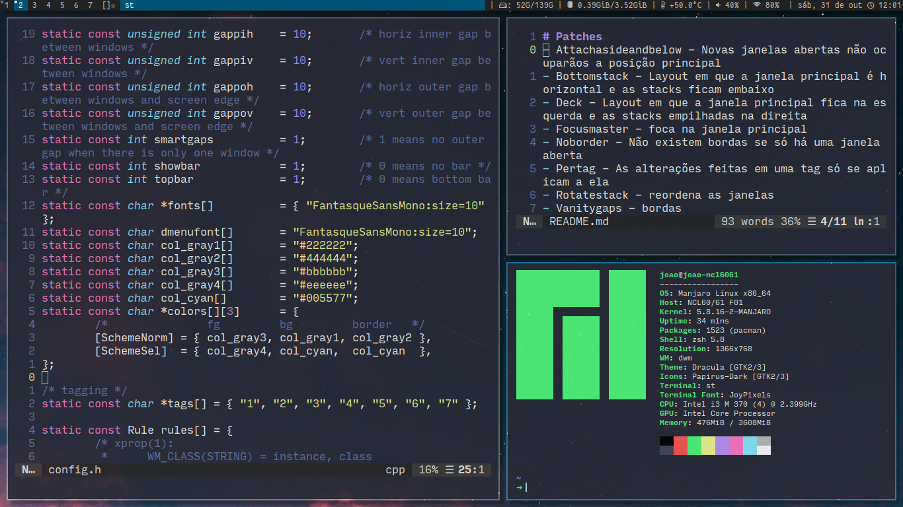

My DWM build.

# Patches
- Attachasideandbelow - novas janelas abertas não ocuparãos a posição principal
- Bottomstack - layout em que a janela principal é horizontal e as stacks ficam embaixo
- Deck - layout em que a janela principal fica na esquerda e as stacks empilhadas na direita
- Focusmaster - foca na janela principal
- Fullscreen - esconde a barra e muda para o layout monocle
- Noborder - não existem bordas se só há uma janela aberta
- Pertag - as alterações feitas em uma tag só se aplicam a ela
- Rotatestack - reordena as janelas
- Vanitygaps - bordas

